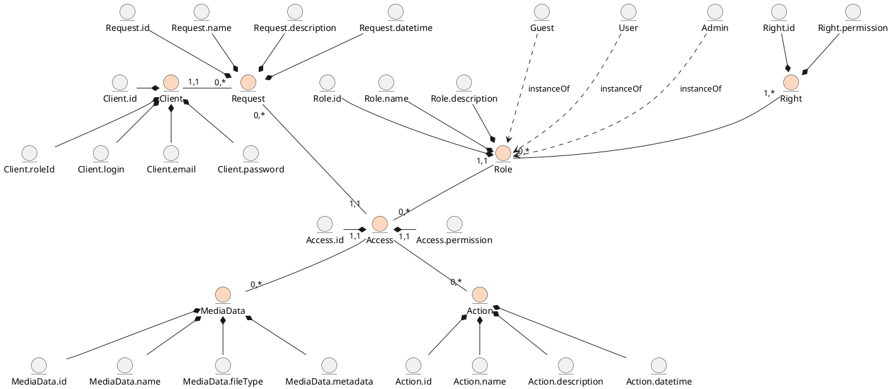
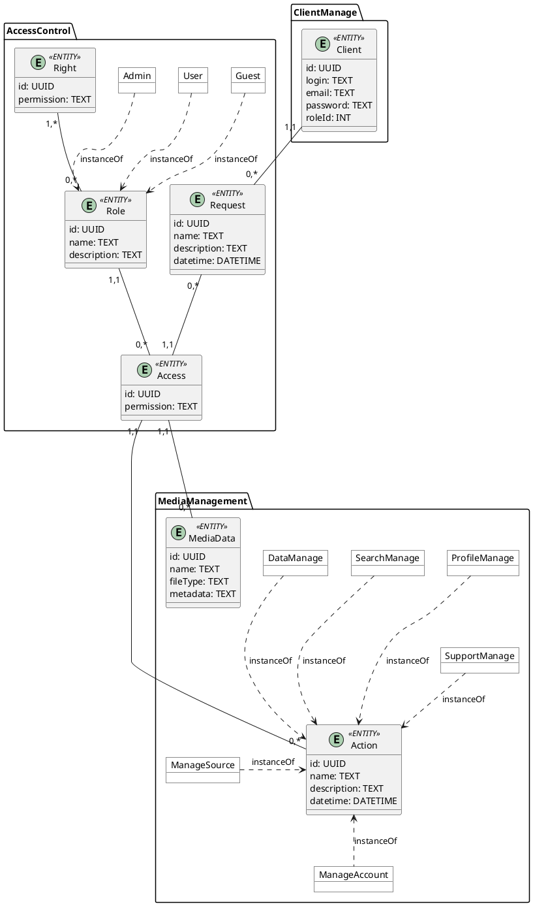
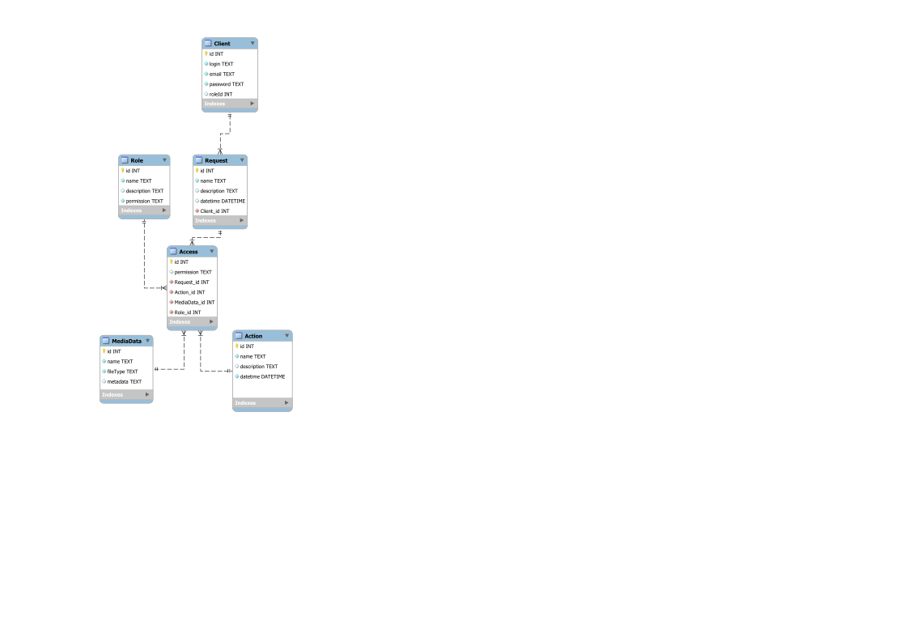

# Проєктування системи

## Модель бізнес-об'єктів

```plantuml
@startuml

entity Client #fdd8bf
  entity Client.id
  entity Client.login
  entity Client.email
  entity Client.password
  entity Client.roleId

  Client.id -r-* Client
  Client.login -u-* Client
  Client.email -u-* Client
  Client.password -u-* Client
  Client.roleId -u-* Client

entity Role #fdd8bf
  entity Role.id
  entity Role.name
  entity Role.description

  Role.id --* Role
  Role.name --* Role
  Role.description --* Role

  entity Guest
  entity User
  entity Admin

  Guest ...> Role : instanceOf
  User ...> Role : instanceOf
  Admin ...> Role : instanceOf

entity Right #fdd8bf
  entity Right.id
  entity Right.permission

  Right.id --* Right
  Right.permission --* Right

entity Request #fdd8bf
  entity Request.id
  entity Request.name
  entity Request.description
  entity Request.datetime
 
  Request.id --* Request
  Request.name --* Request
  Request.description --* Request
  Request.datetime --* Request

entity Access #fdd8bf
  entity Access.id
  entity Access.permission

  Access.id -r-* Access
  Access.permission -l-* Access

entity Action #fdd8bf
  entity Action.id
  entity Action.name
  entity Action.description
  entity Action.datetime

  Action.id -u-* Action
  Action.name -u-* Action
  Action.description -u-* Action
  Action.datetime -u-* Action

entity MediaData #fdd8bf
  entity MediaData.id
  entity MediaData.name
  entity MediaData.fileType
  entity MediaData.metadata

  MediaData.id -u-* MediaData
  MediaData.name -u-* MediaData
  MediaData.fileType -u-* MediaData
  MediaData.metadata -u-* MediaData

Client "1,1"-r-"0,*" Request
Right "1,*"--"0,*" Role
Role "1,1"--"0,*" Access
Request "0,*"---"1,1" Access
Access "1,1"--"0,*" Action
Access "1,1"--"0,*" MediaData

@enduml
```

## ER-модель

```plantuml
@startuml
  package ClientManage {
      entity Client <<ENTITY>> {
        id: UUID
        login: TEXT
        email: TEXT
        password: TEXT
        roleId: INT
      }
  }

  package AccessControl {
      entity Role <<ENTITY>> {
        id: UUID
        name: TEXT
        description: TEXT
      }

      object Guest #white
      object User #white
      object Admin #white

      Guest ..> Role : instanceOf
      User ..> Role : instanceOf
      Admin ..> Role : instanceOf

      entity Right <<ENTITY>> {
        id: UUID
        permission: TEXT
      }

      entity Request <<ENTITY>> {
        id: UUID
        name: TEXT
        description: TEXT
        datetime: DATETIME
      }

      entity Access <<ENTITY>> {
        id: UUID
        permission: TEXT
      }
  }

  package MediaManagement {
      entity Action <<ENTITY>> {
        id: UUID
        name: TEXT
        description: TEXT
        datetime: DATETIME
      }
      
      object SupportManage #white
      object ProfileManage #white
      object SearchManage #white
      object DataManage #white
      object ManageAccount #white
      object ManageSource #white

      SupportManage ..> Action : instanceOf
      ProfileManage ...> Action : instanceOf
      SearchManage ...> Action : instanceOf
      DataManage ...> Action : instanceOf
      ManageAccount .u.> Action : instanceOf
      ManageSource .> Action : instanceOf


      entity MediaData <<ENTITY>> {
        id: UUID
        name: TEXT
        fileType: TEXT
        metadata: TEXT
      }
  }


  Client "1,1"--"0,*" Request
  Right "1,*"--"0,*" Role
  Role "1,1"---"0,*" Access
  Request "0,*"---"1,1" Access
  Access "1,1"---"0,*" Action
  Access "1,1"---"0,*" MediaData

@enduml
```

## Реляційна схема

  

