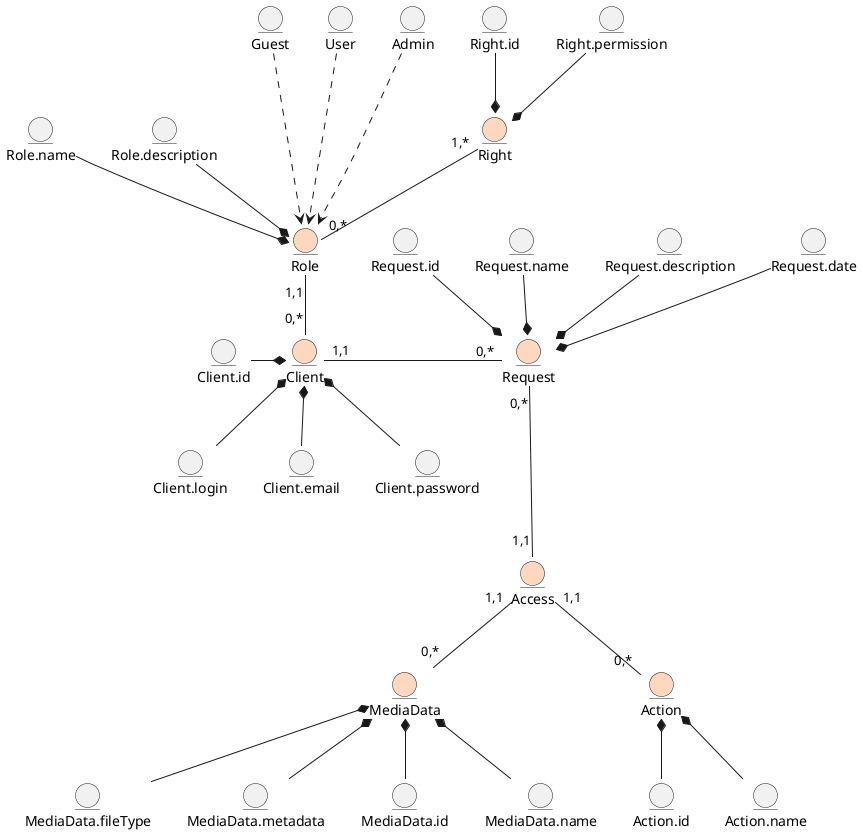

# Проєктування системи

## Модель бізнес-об'єктів


```plantuml
@startuml

entity Client #fdd8bf
  entity Client.id
  entity Client.login
  entity Client.email
  entity Client.password

  Client.id -r-* Client
  Client.login -u-* Client
  Client.email -u-* Client
  Client.password -u-* Client

entity Role #fdd8bf
  entity Role.name
  entity Role.description

  Role.name --* Role
  Role.description --* Role

  entity Guest
  entity User
  entity Admin

  Guest ...> Role
  User ...> Role
  Admin ...> Role

entity Right #fdd8bf
  entity Right.id
  entity Right.permission

  Right.id --* Right
  Right.permission --* Right

entity Request #fdd8bf
  entity Request.id
  entity Request.name
  entity Request.description
  entity Request.date
 
  Request.id --* Request
  Request.name --* Request
  Request.description --* Request
  Request.date --* Request

entity Access #fdd8bf

entity Action #fdd8bf
  entity Action.id
  entity Action.name

  Action.id -u-* Action
  Action.name -u-* Action

entity MediaData #fdd8bf
  entity MediaData.id
  entity MediaData.name
  entity MediaData.fileType
  entity MediaData.metadata

  MediaData.id -u-* MediaData
  MediaData.name -u-* MediaData
  MediaData.fileType -u-* MediaData
  MediaData.metadata -u-* MediaData

Right "1,*"--"0,*" Role
Role "1,1"--"0,*" Client
Client "1,1"-r-"0,*" Request
Request "0,*"---"1,1" Access
Access "1,1"--"0,*" Action
Access "1,1"--"0,*" MediaData

@enduml
```

## ER-модель

```plantuml
```

## Реляційна схема

<center style="margin-top: 16px">
  
</center>
