# Модель прецедентів

## Загальна схема

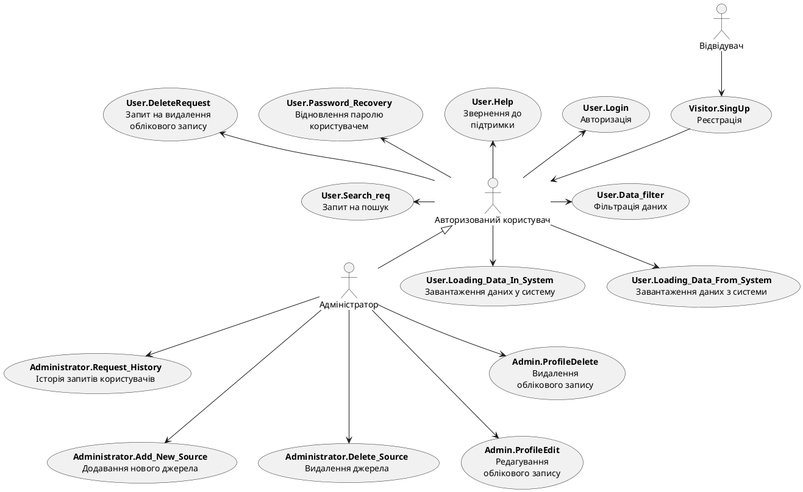

## Схема використання

### Відвідувач

@forkreros твоє додаткове

### Користувач

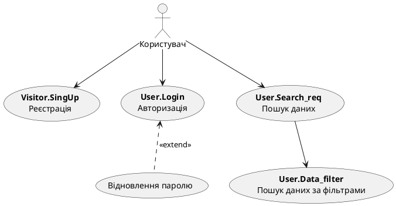

### Адміністратор

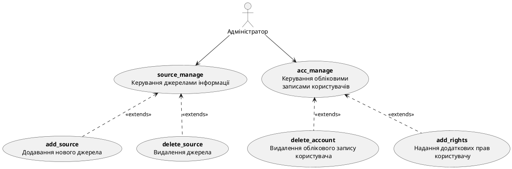

## Сценарії використання

### Відвідувач

| ***ID***:         | Visitor.SingUp                                  |
|-------------------|-------------------------------------------------|
| ***НАЗВА***:      | Реєстрація                                      |
| ***УЧАСНИКИ***:   | Відвідувач, Система                             |
| ***ПЕРЕДУМОВИ***: | В користувача немає облікового запису у системі |
| ***РЕЗУЛЬТАТ***:  | Обліковий запис нового користувача              |
| ***ВИКЛЮЧНІ СИТУАЦІЇ***: | EX.Visitor.SingUp.Login Зайнятий логін   EX.Visitor.SingUp.WrongEmail Невірна електронна пошта   EX.Visitor.SingUp.SimplePass Пароль малої складності  EX.Visitor.SingUp.NotConfirm Користувач не підтвердив реєстрацію |
| ***ОСНОВНИЙ СЦЕНАРІЙ***: | 1. Користувач починає взаємодію;   2. Користувач натискає кнопку реєстрації нового облікового запису;   3. Система надає форму для заповнення   4. Користувач заповнює поля: логін, адреса електронної пошти, пароль   5. Користувач натискає кнопку підтвердження реєстрації  6. Система створює новий обліковий запис   7. Користувач закінчує взаємодію |

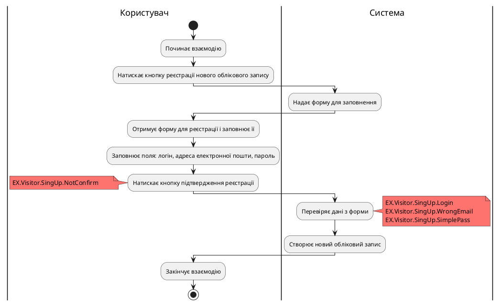

| ***ID***:         | User.Login                                                                     |
|-------------------|-----------------------------------------------------------------------------------|
| ***НАЗВА***:      | Авторизація                                                                       |
| ***УЧАСНИКИ***:   | Відвідувач, Система                                                               |
| ***ПЕРЕДУМОВИ***: | Користувач має обліковий запис у системі                                          |
| ***РЕЗУЛЬТАТ***:  | Успішна авторизація дозволяє користувачеві отримати доступ до функціоналу системи |
| ***ВИКЛЮЧНІ СИТУАЦІЇ***: | Невірний логін   Невірний пароль   Блокування облікового запису  Обліковий запис не існує |
| ***ОСНОВНИЙ СЦЕНАРІЙ***: | 1. Користувач починає взаємодію   2. Користувач натискає кнопку входу до облікового запису   3. Система надає форму для заповнення   4. Користувач заповнює поля: адреса електронної пошти, пароль   5. Система підтверджує виконання   6. Користувач закінчує взаємодію                                                        |

### Користувач

| ***ID***:                | User.Help                                                                               |
|--------------------------|-----------------------------------------------------------------------------------------|
| ***НАЗВА***:             | Звернення користувача до підтримки                                                      |
| ***УЧАСНИКИ***:          | Користувач, система                                                                     |
| ***ПЕРЕДУМОВИ***:        | Користувач потребує допомоги                                                            |
| ***РЕЗУЛЬТАТ***:         | Користувач отримує інформацію про роботу з системою                                     |
| ***ВИКЛЮЧНІ СИТУАЦІЇ***: | Система не змогла ідентифікувати запит - problem_not_defined;  Система не знає вирішення цієї проблеми користувача - problem_no_solution. |

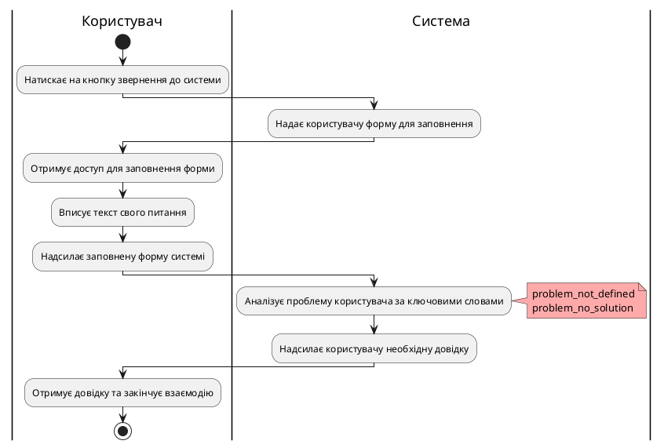

| ***ID***:                | User.Password_Recovery                                                                               |
|--------------------------|------------------------------------------------------------------------------------------------------|
| ***НАЗВА***:             | Відновлення паролю користувачем                                                                      |
| ***УЧАСНИКИ***:          | Користувач, система                                                                                  |
| ***ПЕРЕДУМОВИ***:        | Користувач має обліковий запис у системі                                                             |
| ***РЕЗУЛЬТАТ***:         | Оновлений пароль облікового запису користувача                                                       |
| ***ВИКЛЮЧНІ СИТУАЦІЇ***: | Облікового запису не існує InvalidEmailForRecovery   Помилка переходу на сторінку відновлення InvalidRecoveryLink   Некоректний пароль InvalidPassForRecovery |

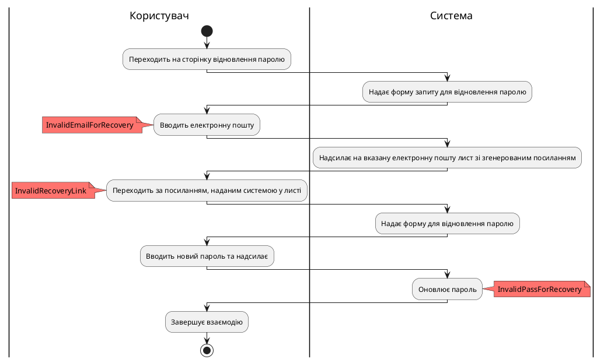

| ***ID***:                | User.DeleteRequest                                                           |
|--------------------------|------------------------------------------------------------------------------|
| ***НАЗВА***:             | Запит на видалення облікового запису                                                           |
| ***УЧАСНИКИ***:          | Користувач, Система                                                          |
| ***ПЕРЕДУМОВИ***:        | Користувач увійшов в обліковий запис                                         |
| ***РЕЗУЛЬТАТ***:         | Успішне видалення облікового запису користувача                              |
| ***ВИКЛЮЧНІ СИТУАЦІЇ***: | Видалення не підтверджене користувачем   Введений пароль є неправильним |
| ***ОСНОВНИЙ СЦЕНАРІЙ***: | 1. Користувач починає взаємодію.   2. Користувач натискає кнопку видалення облікового запису   3. Система надає форму для заповнення   4. Користувач заповнює поля: пароль   5. Користувач натискає кнопку підтвердження   6. Система видаляє обліковий запис даного користувача.   7. Користувач закінчує взаємодію. |

| ***ID***:                | User.Search_req                                                                                               |
|--------------------------|---------------------------------------------------------------------------------------------------------------|
| ***НАЗВА***:             | Запит на пошук                                                                                                |
| ***УЧАСНИКИ***:          | Користувач, система.                                                                                          |
| ***ПЕРЕДУМОВИ***:        | Користувач авторизований.   Користувач вже знаходиться на домашній сторінці або сторінці пошуку системи. |
| ***РЕЗУЛЬТАТ***:         | Відображення результатів пошуку користувачеві.                                                                |
| ***ВИКЛЮЧНІ СИТУАЦІЇ***: | Невдала спроба пошуку через помилково введені дані - EX.User.Search_req.InvalidInput.   Користувач не був авторизований - EX.User.SingUp.False.                   |

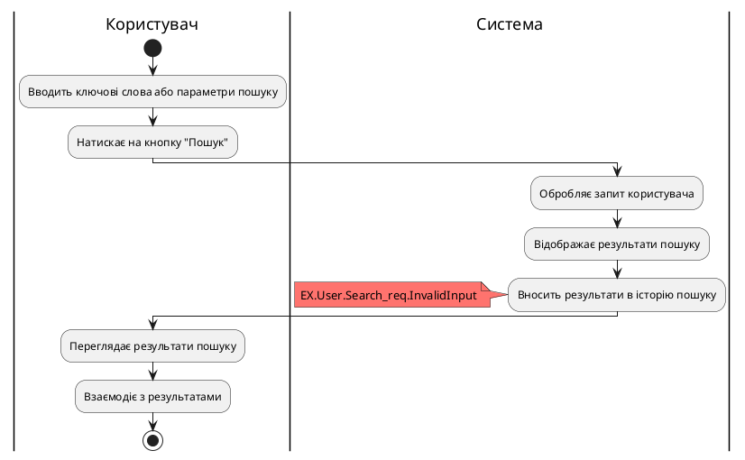

| ***ID***:                | User.Data_filter                                                                     |
|--------------------------|--------------------------------------------------------------------------------------|
| ***НАЗВА***:             | Фільтрація даних                                                                     |
| ***УЧАСНИКИ***:          | Користувач, система.                                                                 |
| ***ПЕРЕДУМОВИ***:        | Користувач вже виконав пошук та отримав результати.   Користувач авторизований. |
| ***РЕЗУЛЬТАТ***:         | Відображення оновлених результатів пошуку з урахуванням обраних фільтрів.            |
| ***ВИКЛЮЧНІ СИТУАЦІЇ***: | Користувач не обрав жодного фільтру - EX.User.Data_filter.NoFilters.   Користувач не був авторизований - EX.User.SingUp.False.         |

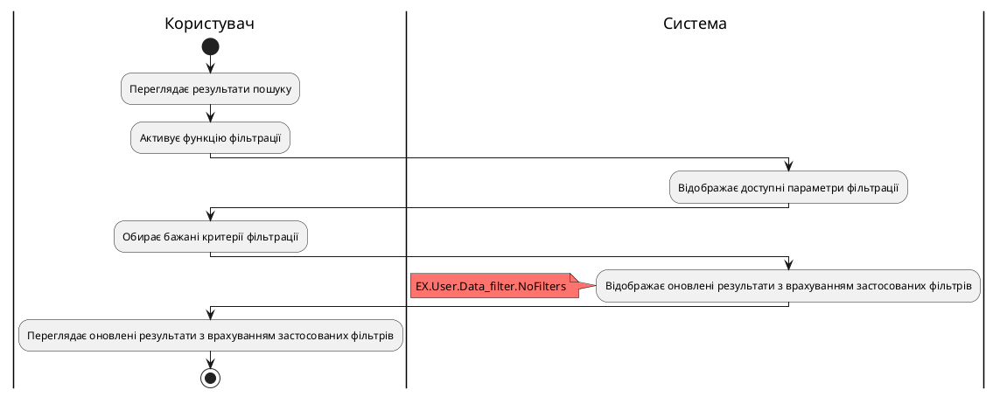

| ***ID***:                | User.Loading_Data_In_System                                            |
|--------------------------|------------------------------------------------------------------------|
| ***НАЗВА***:             | Завантаження даних у систему                                           |
| ***УЧАСНИКИ***:          | Користувач, система                                                    |
| ***ПЕРЕДУМОВИ***:        | Авторизація користувача, наявність даних для завантаження,             |
| ***РЕЗУЛЬТАТ***:         | Дані успішно завантажені у систему                                     |
| ***ВИКЛЮЧНІ СИТУАЦІЇ***: | Помилки під час завантаження - wrong_data_format;   Втрата з'єднання - wrong_connection;   Обмеження прав доступу - wrong_access_rights. |

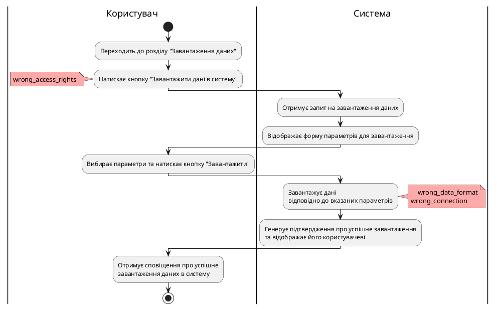

| ***ID***:                | User.Loading_Data_From_System                                                            |
|--------------------------|------------------------------------------------------------------------------------------|
| ***НАЗВА***:             | Завантаження даних з системи                                                             |
| ***УЧАСНИКИ***:          | Користувач, система                                                                      |
| ***ПЕРЕДУМОВИ***:        | Авторизація користувача, доступність даних у системі                                     |
| ***РЕЗУЛЬТАТ***:         | Успішне завантаження даних                                                               |
| ***ВИКЛЮЧНІ СИТУАЦІЇ***: | Відсутність даних у системі - no_data;   Помилки під час завантаження - wrong_connection;   Відсутність електронної пошти - no_email;   Неправильно введено електронну пошту - wrong_email;   Обмеження прав доступу - wrong_access_rights. |

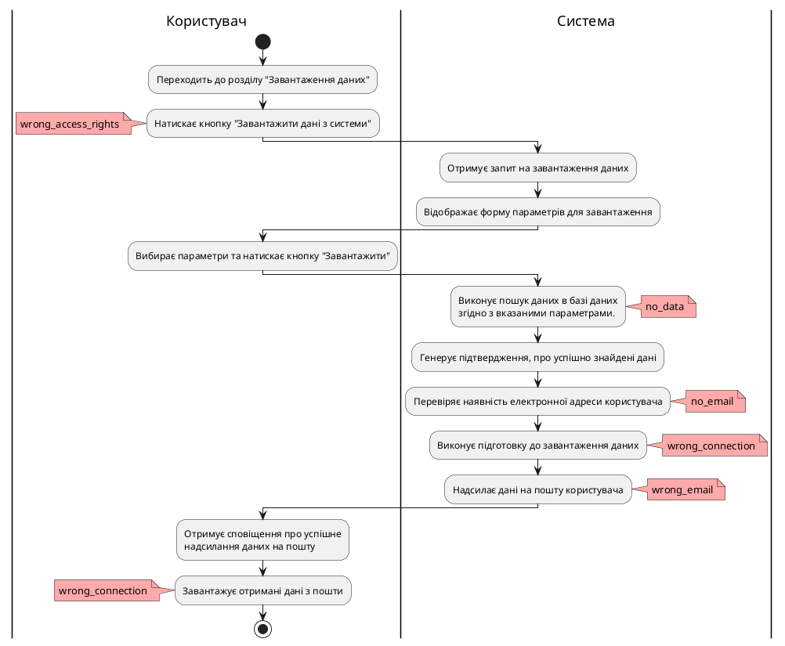

### Адміністратор

| ***ID***:                | Administrator.Request_History                                                              |
|--------------------------|--------------------------------------------------------------------------------------------|
| ***НАЗВА***:             | Історія запитів користувачів                                                               |
| ***УЧАСНИКИ***:          | Адміністратор, користувачі, система                                                        |
| ***ПЕРЕДУМОВИ***:        | Авторизація адміністратора, потреба зберігати та відстежувати історію запитів користувачів |
| ***РЕЗУЛЬТАТ***:         | Збереження та доступ до історії запитів для адміністратора                                 |
| ***ВИКЛЮЧНІ СИТУАЦІЇ***: | Втрата даних - wrong_search;   Обмежений доступ до історії - wrong_access_rights.  |

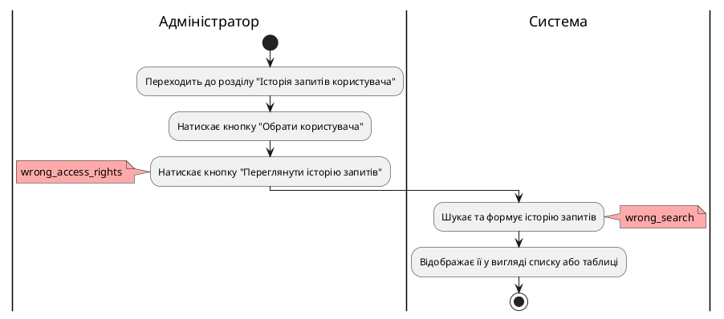

| ***ID***:                | Administrator.Add_New_Source                               |
|--------------------------|------------------------------------------------------------|
| ***НАЗВА***:             | Додавання нового джерела                                   |
| ***УЧАСНИКИ***:          | Адміністратор, система                                     |
| ***ПЕРЕДУМОВИ***:        | Авторизація адміністратора  Потреба в  новому джерелі |
| ***РЕЗУЛЬТАТ***:         | Створення нового джерела                                   |
| ***ВИКЛЮЧНІ СИТУАЦІЇ***: | Помилка аналізу  Брак пам'яті  Доступ заблокований  Відмова адміністратора від збереження                                                                              |
| ***ОСНОВНИЙ СЦЕНАРІЙ***: | 1. Адміністратор обирає опцію "Додати нове джерело".   2. Система надає форму для заповнення 3. Адміністратор вводить необхідні дані у форму  4. Система успішно здійснює з'єднання та отримує доступ до медіа-контенту   5. Адміністратор зберігає налаштування.|

| ***ID***:                | Administrator.Delete_Source                                                                          |
|--------------------------|------------------------------------------------------------------------------------------------------|
| ***НАЗВА***:             | Видалення джерела                                                                                    |
| ***УЧАСНИКИ***:          | Адміністратор, система                                                                               |
| ***ПЕРЕДУМОВИ***:        | Авторизація адміністратора, потреба видалити джерело                                                 |
| ***РЕЗУЛЬТАТ***:         | Джерело видалене                                                                                     |
| ***ВИКЛЮЧНІ СИТУАЦІЇ***: | Обмежена кількість прав доступу  Відсутність джерела  Відмова адміністратора від видалення |
| ***ОСНОВНИЙ СЦЕНАРІЙ***: | 1. Адміністратор обирає опцію "Видалити джерело".  2. Система надає список джерел.  3. Адміністратор знаходить в списку джерел потрібне джерело. 4. Адміністратор вибирає опцію "Видалити" поруч з вибраним джерелом. 5. Система створює запит на видалення облікового запису.  4. Адміністратор підтверджує рішення про видалення джерела. 5. Система видаляє обране джерело зі своїх налаштувань та бази даних.                                    |

| ***ID***:         | Admin.ProfileEdit                                                                          |
|-------------------|--------------------------------------------------------------------------------------------|
| ***НАЗВА***:      | Редагування облікового запису                                   |
| ***УЧАСНИКИ***:   | Адміністратор, система                                                                     |
| ***ПЕРЕДУМОВИ***: | Адміністратор виконав авторизацію, адміністратор має права доступу до редагування профілю. |
| ***РЕЗУЛЬТАТ***:  | Змінені дані облікового запису користувача                                                 |
| ***ВИКЛЮЧНІ СИТУАЦІЇ***: | Адміністратор не авторизований  Адміністратор не має доступу до редагування профілю  Обраного користувача не існує  Адміністратор не підтверджує зміни облікового запису|
| ***ОСНОВНИЙ СЦЕНАРІЙ***: | 1. Адміністратор знаходить користувача, чий профіль потрібно редагувати.  2. Адміністратор натискає на кнопку "Редагувати профіль".  3. Система відкриває форму з даними профілю користувача.  4. Адміністратор вносить зміни до даних профілю.  5. Адміністратор натискає на кнопку "Зберегти".  6. Система оновлює дані профілю.  7. Система повідомляє про успішне оновлення профілю. |

| ***ID***:         | Admin.ProfileDelete                                                               |
|-------------------|-----------------------------------------------------------------------------------|
| ***НАЗВА***:      | Видалення облікового запису                           |
| ***УЧАСНИКИ***:   | Адміністратор, система                                                            |
| ***ПЕРЕДУМОВИ***: | Адміністратор виконав авторизацію, адміністратор має права для видалення профілю. |
| ***РЕЗУЛЬТАТ***:  | Обліковий запис видалений адміністратором                                         |
| ***ВИКЛЮЧНІ СИТУАЦІЇ***: | Адміністратор не авторизований  Адміністратор не має доступу до видалення облікового запису  Обраного користувача не існує  Адміністратор не підтверджує видалення облікового запису |
| ***ОСНОВНИЙ СЦЕНАРІЙ***: | 1. Адміністратор знаходить користувача, чий обліковий запис потрібно видалити.  2. Адміністратор натискає на кнопку "Видалити обліковий запис".  3. Система відкриває вікно з попередженням про видалення профілю.  4. Адміністратор натискає кнопку "Підтвердити"  5. Система видаляє профіль користувача з усіма даними  6. Система повідомляє адміністратору про успішне видалення профілю. |
